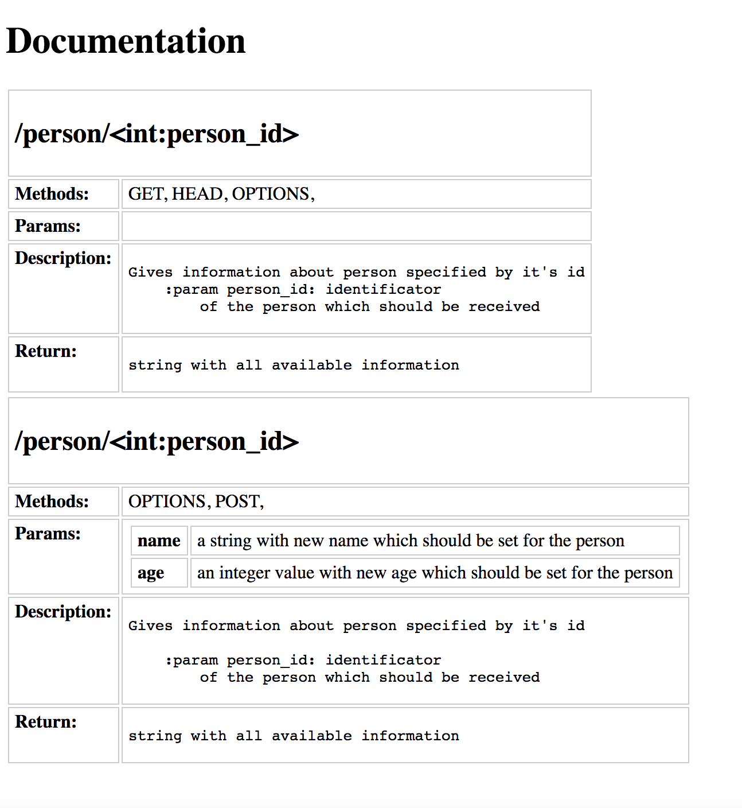

# FlaskAutoDocs

A simple package which adds autogenerated documentation page to your API service.

## Installation

You may use pip:

`pip install git+git://github.com/lisfer/FlaskAutoDocs.git#egg=FlaskAutoDocs`

## How it works

Program received `Url`, `Methods` information from Flask object. And `Params`, `Description`, `Return` information from the function DocString.

### Params

Lines from DocString are interpreted  as `Params` if they matches next pattern:

`:api_param <param_name>: some description`

This will be parsed as `{<param_name>: 'some description'}`

###  Return
Here goes everything that follows `:return:` pattern in DocString.

### Descript
It takes a text from the beginning of the DocString till we met `:param` | `:api_param` | `:return` patterns

## How to use:

You need to add `@api_docs.doc` decorator to the function that should be documented. And to call `api_docs.html()` method to receive html page with results.

```python
from flask import Flask
from flask_auto_docs import FlaskAutoDocs

app = Flask(__name__)
api_docs = FlaskAutoDocs(app)

@app.route('/person')
@api_docs.doc
def update_person():
    pass
    
@app.route('/docs')
def docs():
    return api_docs.html()
```

## Example

```python
@app.route('/person/<int:person_id>')
@app.api_doc.doc
def get_person(person_id):
    """
    Gives information about person specified by it's id
    :param person_id: identificator
        of the person which should be received
    :return: string with all available information
    """
    return f'{person_id} person'


@app.route('/person/<int:person_id>', methods=['POST'])
@app.api_doc.doc
def set_person(person_id):
    """
    Updated information about person specified by it's id

    :param person_id: identificator
        of the person which should be received
    :api_param name: a string with new name which should be set for the person
    :api_param age: an integer value with
        new age which should be set for the person

    :return: string with all available information
    """
    name = request.form.get('name')
    age = request.form.get('age')
    return f"""
        {person_id} person. New name: {name}, new age: {age}
    """
```

that will gave us next result:


    
